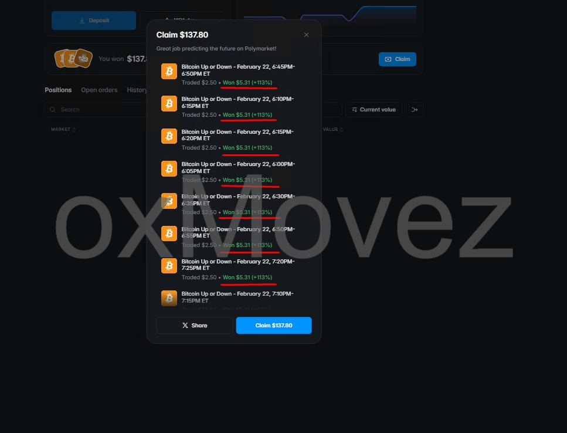
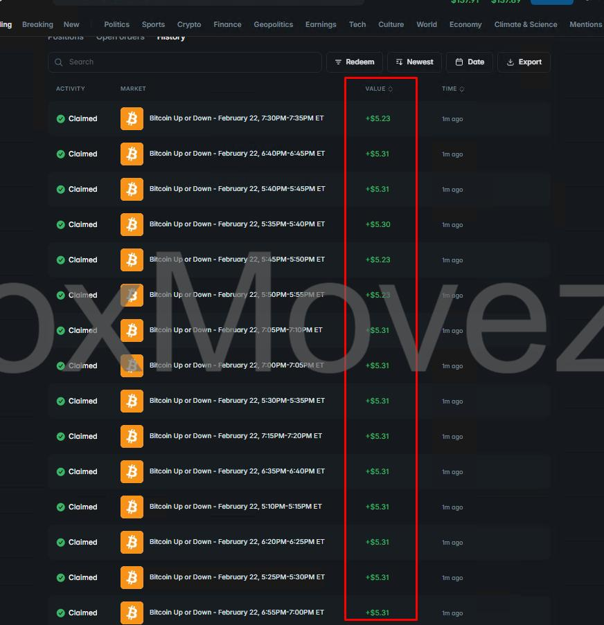
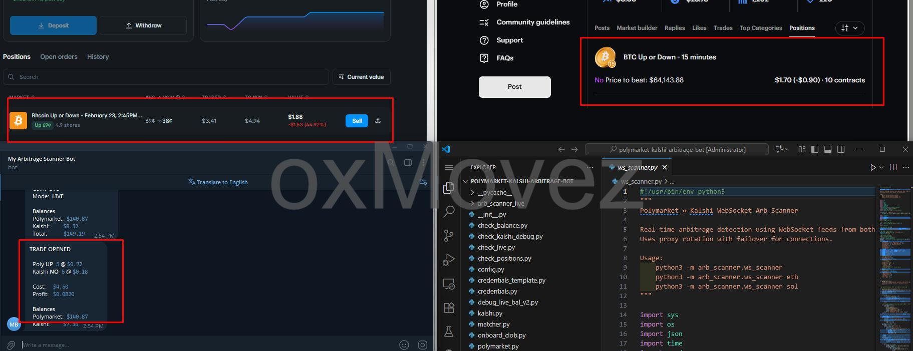

# Polymarket Arbitrage Trading Bot Pack ( 5min/15min/1hr arbitrage bot + Copy Trading + Cross‑Market Arb)

**English** | [中文（简体）](README.zh-CN.md)

**Contact / Buy full versions / Premium support:** Telegram [@movez_x](https://t.me/movez_x)

---

## Why this pack

This repository is a **curated pack of Polymarket trading bots and strategies** built for traders who care about **speed**, **edge**, and **automation**:

- **Arbitrage-style bots** (market-neutral setups where possible)
- **Copy trading automation** (follow wallet flows in real time)
- **Ultra-fast execution** (Rust low-latency tooling)
- **Specialized trading UIs** (sports click-to-bet execution)

If you want the **full source code**, advanced features, help deploying on a VPS, custom strategy work, or a premium version, message me on Telegram: **[@movez_x](https://t.me/movez_x)**.

---

## Bots included

> Tip: Each folder has its own README with setup notes and more screenshots.

### 1) Polymarket 5‑min / 15‑min BTC Arbitrage Bot (Rust)

- **GitHub repo**: [`PolyScripts/polymarket-5min-15min-1hr-btc-arbitrage-trading-bot-rust`](https://github.com/PolyScripts/polymarket-5min-15min-1hr-btc-arbitrage-trading-bot-rust)
- **Best for**: Traders who need **speed**
- **Core idea**: Low-latency order placement for short window BTC Up/Down markets, with configurable dry-run + live modes
- **Want 1hr / XRP / SOL / ETH bots?** Message Telegram **[@movez_x](https://t.me/movez_x)** to buy the premium builds.

Preview:

---

### 2) Polymarket ↔ Kalshi Arbitrage Bot (Python)

- **GitHub repo**: [`PolyScripts/polymarket-kalshi-crossplatform-arbitrage-bot`](https://github.com/PolyScripts/polymarket-kalshi-crossplatform-arbitrage-bot)
- **Best for**: Cross-market pricing inefficiencies (15-min windows)
- **Core idea**: Watch both venues in real time, confirm pricing edges, and execute hedged legs with thresholds + logging
- **Upgrade request**: Want to extend features to the **1hr market**? Message **[@movez_x](https://t.me/movez_x)**.

Preview:

---

### 3) Direction Hunting Bot (strategy + alerts)

- **Best for**: Directional traders looking for short-window momentum/flow setups
- **Core idea**: Scan multiple symbols/windows, enter when criteria hit, and manage exits with take-profit logic

Preview:

---

### 4) Spread Farming Bot (paired exits / market making style)

- **Best for**: Traders looking for systematic, repeatable micro-edges
- **Core idea**: Farm spreads using disciplined entries/exits, logging P&L, and repeatable rules

Preview:

---

### 5) Polymarket Copy Trading Bot (Python)

- **GitHub repo**: [`PolyScripts/polymarket-copy-trading-bot-py`](https://github.com/PolyScripts/polymarket-copy-trading-bot-py)
- **Best for**: Copying top wallets automatically
- **Core idea**: Mirror BUY/SELL actions from one or multiple target wallets with configurable sizing + risk limits

Preview:

---

### 6) Polymarket Sports Betting Execution Bot (Rust + Python server)

- **GitHub repo**: [`PolyScripts/polymarket-sports-betting-trading-py`](https://github.com/PolyScripts/polymarket-sports-betting-trading-py)
- **Best for**: Manual traders who want **click-to-bet speed**
- **Core idea**: A focused live-sports interface with real-time prices; you click, it executes fast (FAK/market-style flow)

Preview:

---

## Get full code / add features / premium help

This pack contains **working demos and strategy previews**. Many traders ask for:

- Full source + private modules
- Faster execution paths / anti-slippage settings
- More symbols, more windows, more venues
- VPS deployment, monitoring, and Telegram alerts
- Custom strategy rules and risk controls

Message me on Telegram: **[@movez_x](https://t.me/movez_x)**.

---

## Disclaimer

These tools are provided for educational and research purposes. Trading involves risk. You are responsible for configuration, compliance, and all trading outcomes.

