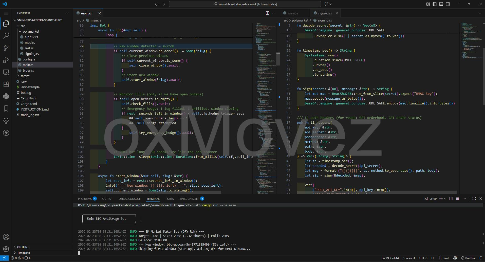
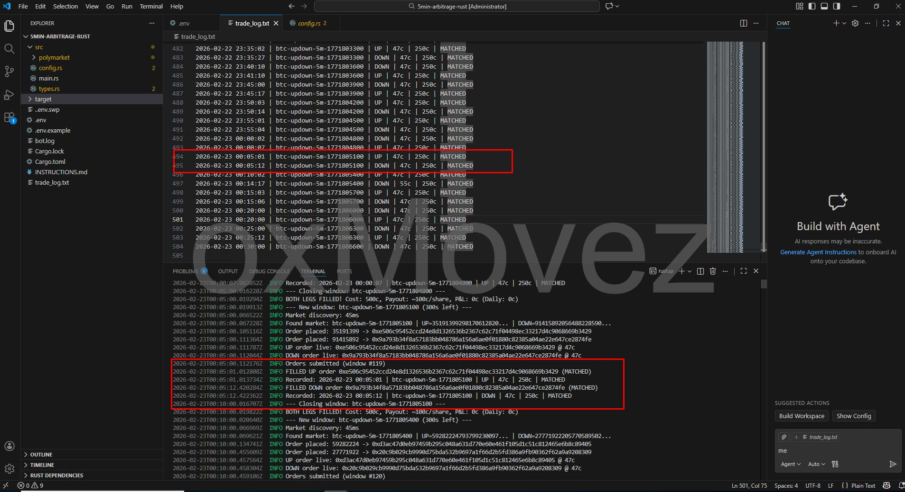
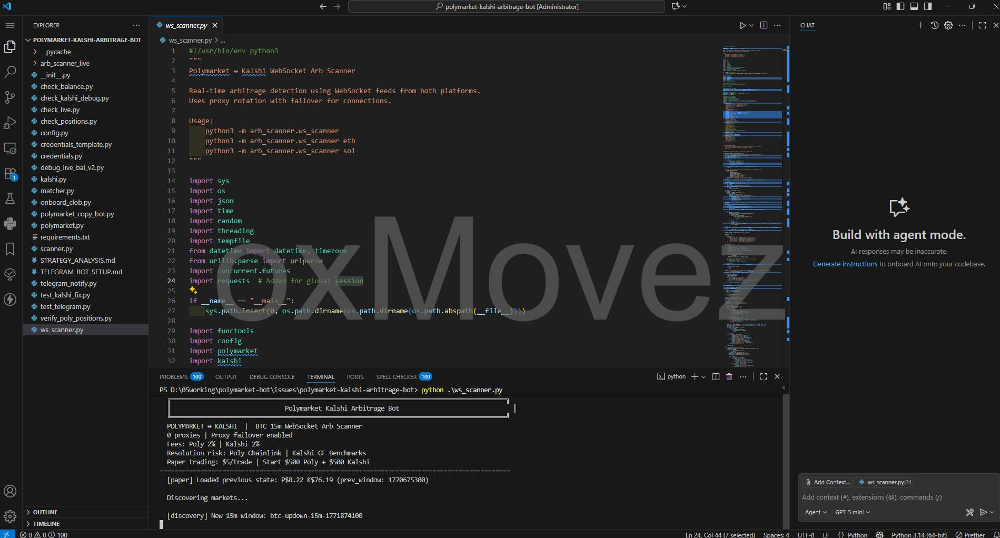
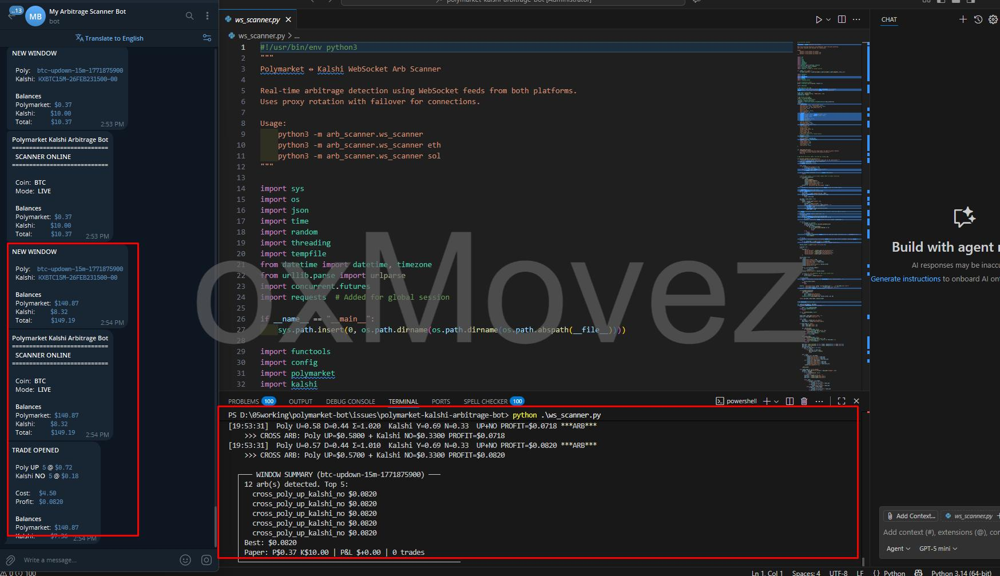
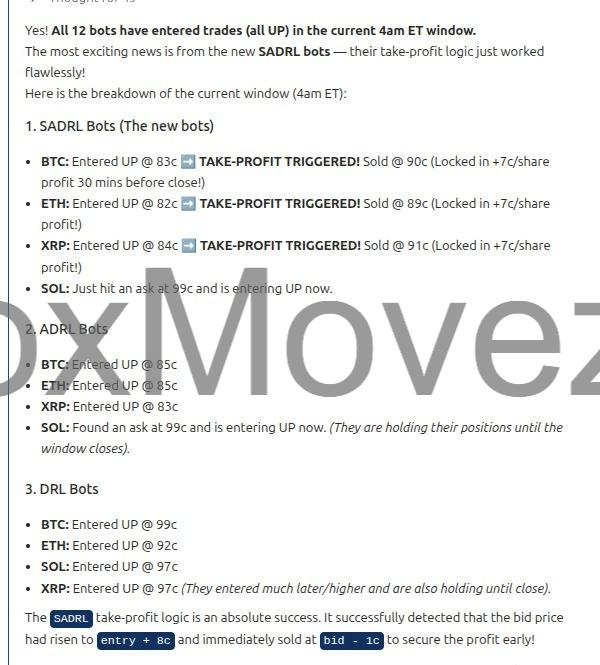
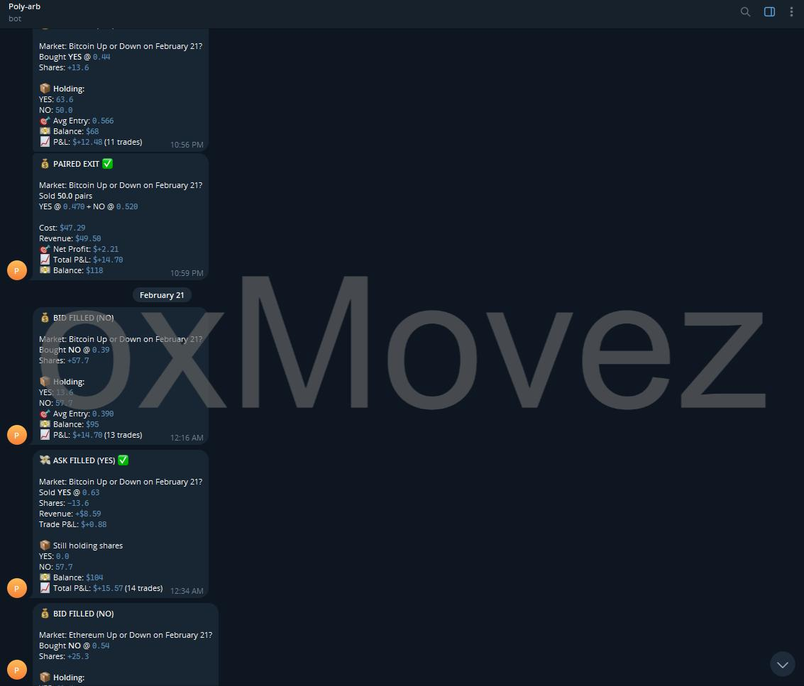

# Polymarket 套利交易机器人合集（跟单 + 跨平台套利 + 低延迟执行）

[English](README.md) | **中文（简体）**

**联系 / 购买完整版 / 高级支持：** Telegram [@movez_x](https://t.me/movez_x)

---

## 为什么选择这个合集

这是一个面向交易者的 **Polymarket 交易机器人与策略合集**，核心解决三件事：**速度**、**优势（edge）**、**自动化**。

- **套利风格策略**（尽量市场中性 / 可对冲）
- **链上钱包跟单**（实时镜像目标钱包的买卖）
- **超低延迟执行**（Rust 工具链，适合抢速度）
- **专用交易界面**（体育盘快速点击下单）

如果你想要 **完整源码**、定制功能、部署/运维协助（VPS）、或高级版本，请私信 Telegram：**[@movez_x](https://t.me/movez_x)**。

---

## 已包含的机器人

> 提示：每个文件夹内都有自己的 README，包含更详细的截图与运行说明。

### 1) Polymarket 5 分钟 / 15 分钟 BTC 套利机器人（Rust）

- **GitHub 仓库**：[`PolyScripts/polymarket-5min-15min-1hr-btc-arbitrage-trading-bot-rust`](https://github.com/PolyScripts/polymarket-5min-15min-1hr-btc-arbitrage-trading-bot-rust)
- **适用人群**：对 **速度** 有强需求的交易者
- **策略概述**：为短周期 BTC Up/Down 窗口提供低延迟下单能力，支持 dry-run 与实盘模式
- **想买 1 小时 / XRP / SOL / ETH 版本？** 直接 Telegram 联系 **[@movez_x](https://t.me/movez_x)** 获取高级版。

预览：

---

### 2) Polymarket ↔ Kalshi 跨平台套利机器人（Python）

- **GitHub 仓库**：[`PolyScripts/polymarket-kalshi-crossplatform-arbitrage-bot`](https://github.com/PolyScripts/polymarket-kalshi-crossplatform-arbitrage-bot)
- **适用人群**：做跨平台价差 / 15 分钟窗口机会的交易者
- **策略概述**：WebSocket 实时监控两边价格，满足阈值后执行对冲腿，并落地完整日志
- **升级需求**：想把功能扩展到 **1 小时市场**？请联系 **[@movez_x](https://t.me/movez_x)**。

预览：

---

### 3) 方向狩猎机器人（策略 + 通知）

- **适用人群**：做短窗口方向 / 动量 / 流量的交易者
- **策略概述**：扫描多品种与时间窗，在条件触发时入场，并用止盈/风控规则管理退出

预览：

---

### 4) 价差耕作机器人（paired exit / 类做市风格）

- **适用人群**：想做系统化、可重复微利策略的交易者
- **策略概述**：用纪律化的进出场规则“耕作”价差，记录 P&L 并重复执行

预览：

---

### 5) Polymarket 跟单机器人（Python）

- **GitHub 仓库**：[`PolyScripts/polymarket-copy-trading-bot-py`](https://github.com/PolyScripts/polymarket-copy-trading-bot-py)
- **适用人群**：想自动跟随高手钱包的交易者
- **策略概述**：实时镜像目标钱包的 BUY/SELL，可跟随多个钱包，支持多种仓位模式与风险限制

预览：

---

### 6) Polymarket 体育盘执行机器人（Rust + Python 服务）

- **GitHub 仓库**：[`PolyScripts/polymarket-sports-betting-trading-py`](https://github.com/PolyScripts/polymarket-sports-betting-trading-py)
- **适用人群**：手动交易但需要更快下单的体育盘交易者
- **策略概述**：提供聚焦直播体育盘的简洁界面与实时价格；你负责决策，机器人负责快速执行

预览：

---

## 获取完整版 / 加功能 / 高级支持

这个合集提供 **可运行 demo 与策略预览**。常见需求包括：

- 完整源码与私有模块
- 更快的执行路径、反滑点设置
- 更多币种、更多时间窗、更多市场
- VPS 部署、监控、Telegram 告警
- 定制策略规则与风控模块

请联系 Telegram：**[@movez_x](https://t.me/movez_x)**。

---

## 免责声明

本项目仅用于学习与研究。交易有风险，请自行承担配置、合规与交易结果。

